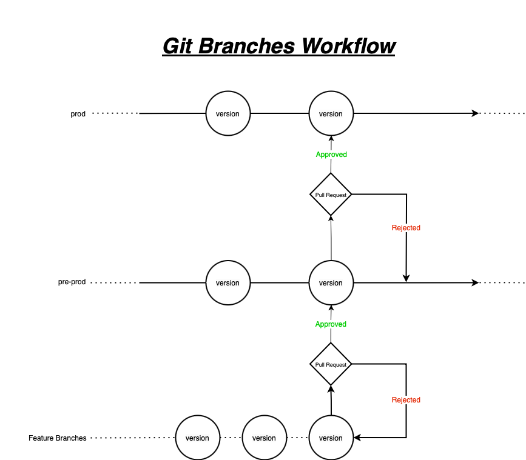

## Branching Model and Collaboration

We follow the Git Flow development model for code collaboration. The model consists of a `prod` branch and a `pre-prod` branch. Here's an overview of the process:

- Create feature branches from the `pre-prod` branch.
- After completing your work, create a Pull Request to merge your feature branch back into the `pre-prod` branch.
- Approvers review the changes and periodically merge the `pre-prod` branch back into the `prod` branch.
- Direct pushes to the `prod` branch are not allowed.
- Code should not be pushed directly to the `pre-prod` branch, except for hotfixes when the developer has high confidence in code quality.
- We will merge Pull Requests from `pre-prod` to `prod` together during our weekly meetings.

## Reasons for rejecting a Pull Request

- Merge conflicts.
- Errors
- Requirnemtns not met.
- Poor code quality

